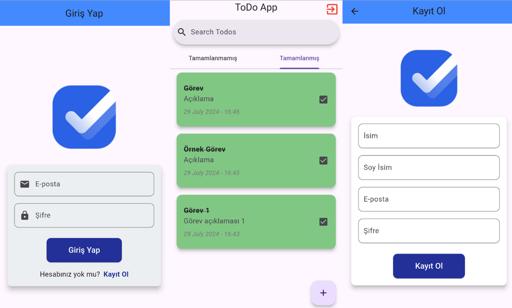

# Todo Uygulaması

## İçindekiler

- [Giriş](#giriş)
- [Özellikler](#özellikler)
- [Kurulum](#kurulum)
- [Proje Dosya Yapısı](#proje-dosya-yapısı)
- [Kullanılan Paketler](#kullanılan-paketler)
- [Kullanım](#kullanım)
- [Video](#video)

## Giriş

Todo Uygulaması, kullanıcıların günlük görevlerini yönetmelerine yardımcı olmak için tasarlanmış basit bir uygulamadır.



## Özellikler

- **Giriş Yap**: Firebase kullanarak güvenli kimlik doğrulama.
- **Kayıt Ol**: Yeni bir hesap oluşturup görevleri yönetmeye başlama.
- **Görev Ekleme**: Yeni görevleri kolayca ekleyin.
- **Görev Silme**: Artık ihtiyaç duyulmayan görevleri silin.
- **Görev Güncelleme**: Mevcut görevleri güncel tutmak için düzenleyin.
- **Görev Arama**: Arama işlevi ile belirli görevleri hızlıca bulun.

## Kurulum

Bu projeye başlamak için aşağıdaki adımları izleyebilirsiniz:

1. Depoyu klonlayın:
   ```sh
   git clone https://github.com/mehmetakifkucukkaya/todo_app-flutter.git
   ```
2. Proje dizinine gidin:
   ```sh
   cd todo_app
   ```
3. Bağımlılıkları yükleyin:
   ```sh
   flutter pub get
   ```
4. Uygulamayı çalıştırın:
   ```sh
   flutter run
   ```

<br>

## Proje Dosya Yapısı

| Klasör/Dosya       | Açıklama                                               |
| ------------------ | ------------------------------------------------------ |
| `lib`              | **Ana kaynak kod klasörü**                             |
| ├── `bindings`     | **Bağımlılık enjeksiyonu için bağlayıcıları içeriyor** |
| ├── `config`       | **Uygulama yapılandırma dosyalarını içeriyor**         |
| │ ├── routes       | Uygulama rotaları tanımlamalarının olduğu yapı         |
| │ └── themes       | Uygulama tema tanımlamaları                            |
| ├── `controllers`  | **GetX kontrolcüleri**                                 |
| │── `core`         | **Temel kontrolcüler**                                 |
| │├── constants     | Uygulamada kullanılan sabit değerler                   |
| │└── validators    | Form doğrulayıcıları                                   |
| ├── `data`         | **Veri katmanı**                                       |
| │ ├── models       | Veri modelleri                                         |
| │ └── services     | Harici servis entegrasyonları                          |
| └── `presentation` | **UI katmanı**                                         |
| ├── atoms          | En küçük UI bileşenleri (button, textfield vb... )     |
| ├── molecules      | Atom gruplarından oluşan bileşenler (form vb...)       |
| ├── organism       | Daha karmaşık UI bileşenleri                           |
| └── views          | Sayfanın tam görünüm kodları                           |

## Kullanılan Paketler

| Paket Adı            | Açıklama                            |
| -------------------- | ----------------------------------- |
| `get`                | State yönetimi için                 |
| `firebase_core`      | Firebase core fonksiyonları için    |
| `firebase_auth`      | Kimlik doğrulama işlemleri için     |
| `cloud_firestore`    | Firestore veritabanı işlemleri için |
| `lottie`             | Animasyonlar için                   |
| `intl`               | Tarih formatlaması için             |
| `json_serializable`  | JSON serileştirme için              |
| `build_runner`       | Kod üretimi için                    |
| `very_good_analysis` | Kod analizi için                    |

## Kullanım

### Giriş Yap

Kullanıcılar e-posta ve şifre ile giriş yapabilir. Firebase Kimlik Doğrulama ile güvenli giriş sağlanmış oluyor.

### Kayıt Ol

Yeni kullanıcılar, gerekli bilgileri (e-posta, şifre, isim ve soyisim) girerek hesap oluşturabilir.

### Görev Ekleme

Kullanıcılar, görev detaylarını girip kaydederek yeni görevler ekleyebilir. Görevler Cloud Firestore'da eklenme tarihine göre saklanır

### Görev Silme

Kullanıcılar, artık ihtiyaç duyulmayan görevleri seçerek silebilir.

### Görev Güncelleme

Kullanıcılar, mevcut görevlerin detaylarını güncelleyebilir.

### Görev Arama

Arama işlevi ile kullanıcılar, görevleri anahtar kelimeler girerek hızlıca bulabilir.


## Video
Uygulamanın nasıl çalıştığını görmek için demoyu izleyebilirsiniz: [Video](https://youtu.be/2EcLA9ZDh4I)


